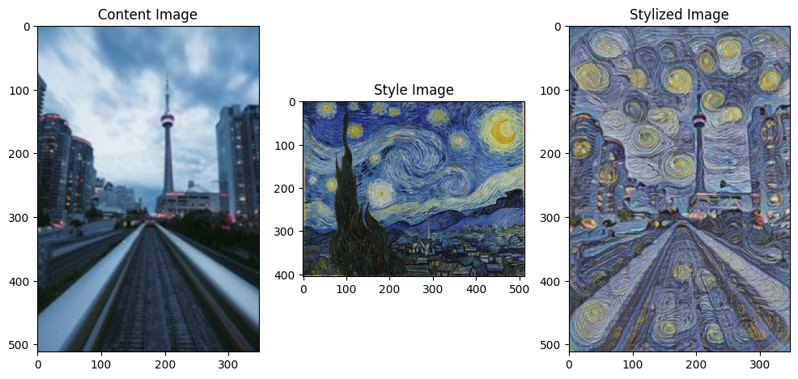
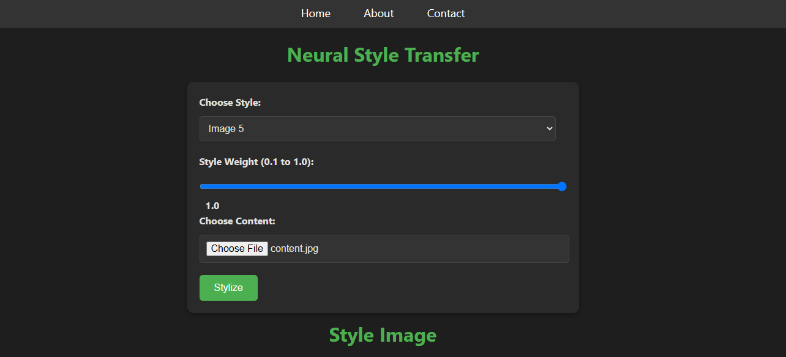
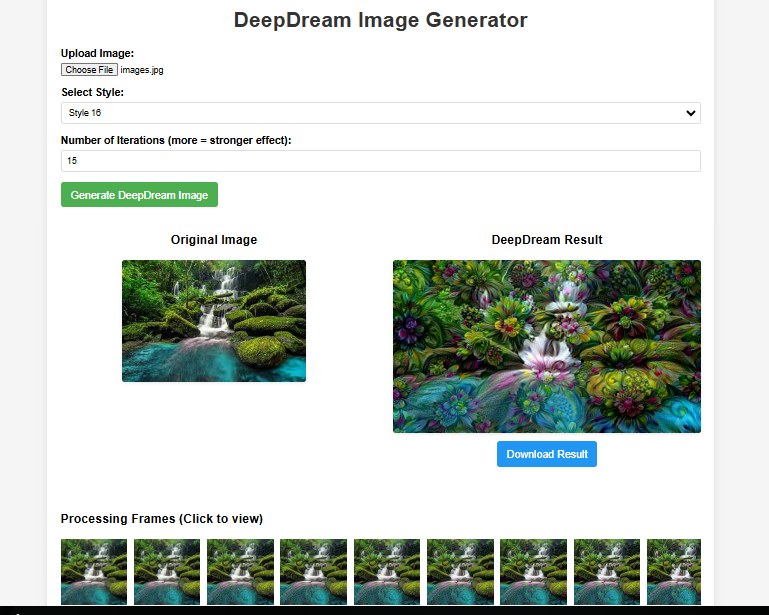

# DeepDream and Neural Style Transfer Projects

This repository contains projects related to DeepDream and Neural Style Transfer (NST), including:
- Flask-based web applications for DeepDream and NST.
- Google Colab notebooks for experimenting with DeepDream and NST.

## About

This repository contains notebooks for applying DeepDream and Style Transfer to images. You can use these techniques to create unique and visually stunning artworks, combining the surreal dreams of DeepDream with the artistic styles of famous painters or your own custom styles.

## Key Features

- Apply Google's DeepDream to your images and witness dreamlike hallucinatory effects.
- Transfer the style of famous artworks or your custom styles to your images.
- Learn and experiment with deep learning-based image processing techniques.
- Easily customize and fine-tune transformations according to your preferences.

## Contents

- DeepDream Notebook
- Style Transfer Notebooks
- Flask-based web applications for DeepDream and NST
- Sample images for experimentation

## Getting Started

To get started, simply clone this repository and follow the instructions in the respective notebooks., web-applications. Make sure you have the required dependencies installed.

## Dependencies

- Python 
- Jupyter Notebook
- TensorFlow
- PIL (Python Imaging Library)
- Flask

---
# Results

## DeepDream

Sample Image:

Generated Images:

|  |  |  |  |
|---------|---------|---------|---------|
|  |  |  |  |

|  |  |  |
|---------|---------|---------|
|  |  |  |

## Style Transfer

### Magenta Arbitary Model

Generated Image:

|  |  
|---------|
|  | 

### Efficientnet Model

Generated Image:

---
## Application Interface

**Neural Style Transfer**

 

**DeepDream**

