# DeepDream, StyleTransfer Projects

Welcome to this repository, where you can explore the fascinating world of creative image transformations using DeepDream and Style Transfer techniques in image processing.

## About

This repository contains notebooks for applying DeepDream and Style Transfer to images. You can use these techniques to create unique and visually stunning artworks, combining the surreal dreams of DeepDream with the artistic styles of famous painters or your own custom styles.

## Key Features

- Apply Google's DeepDream to your images and witness dreamlike hallucinatory effects.
- Transfer the style of famous artworks or your custom styles to your images.
- Learn and experiment with deep learning-based image processing techniques.
- Easily customize and fine-tune transformations according to your preferences.

## Contents

- DeepDream Notebook
- Style Transfer Notebook
- Sample images for experimentation

## Getting Started

To get started, simply clone this repository and follow the instructions in the respective notebooks. Make sure you have the required dependencies installed.

## Dependencies

- Python 
- Jupyter Notebook
- TensorFlow
- PIL (Python Imaging Library)

# Results

## DeepDream

Sample Image:

Generated Images:

|  |  |  |  |
|---------|---------|---------|---------|
| 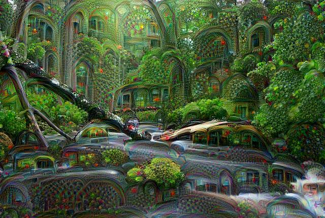 | 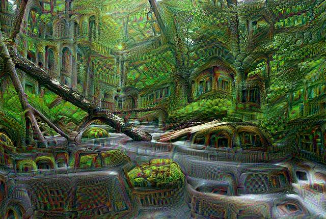 | 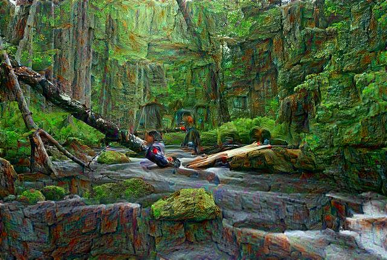 | 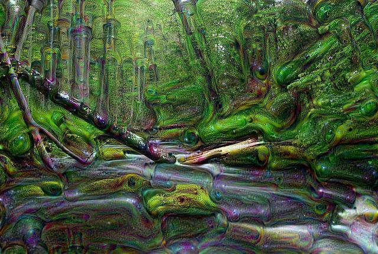 |

|  |  |  |
|---------|---------|---------|
| 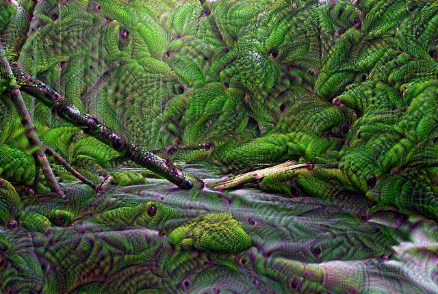 | 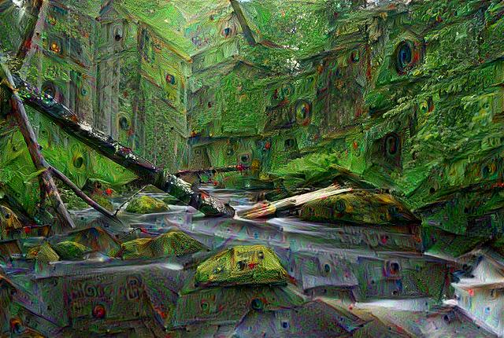 | 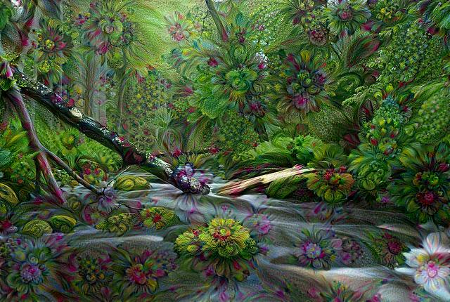 |

## Style Transfer

### Arbitary

Generated Image:

|  |  |  |  |
|---------|---------|---------|---------|
| 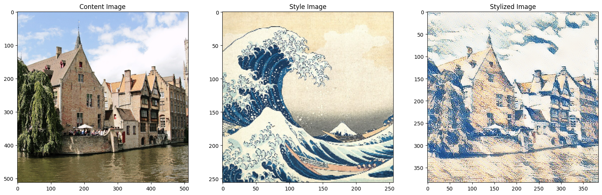 | 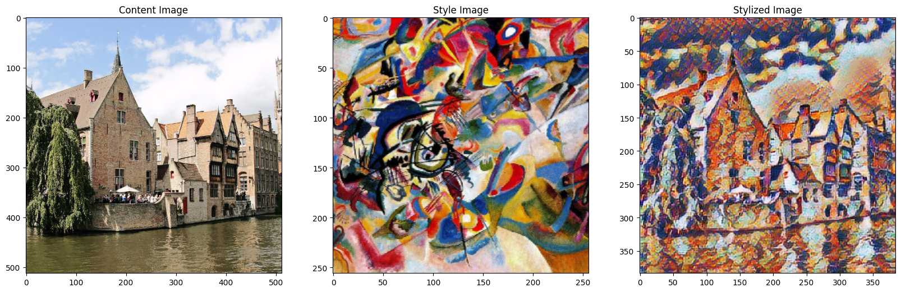 | 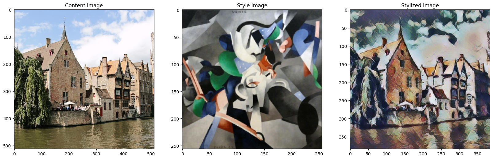 | 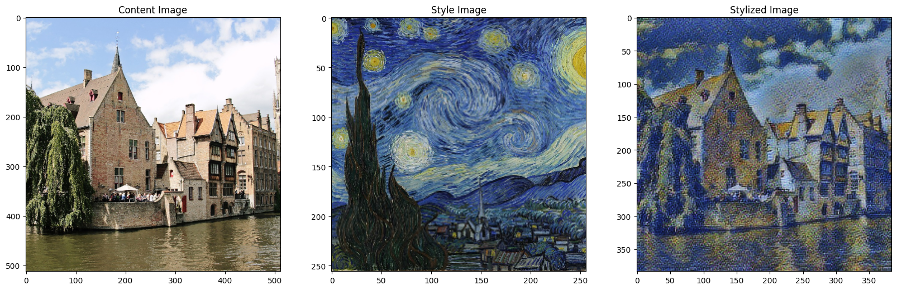 |

### Efficientnet

Generated Image:

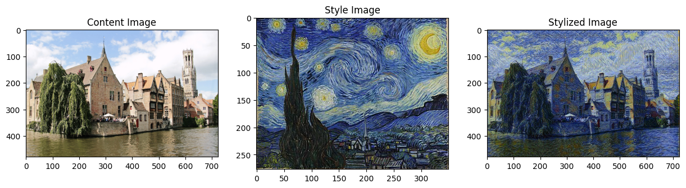

